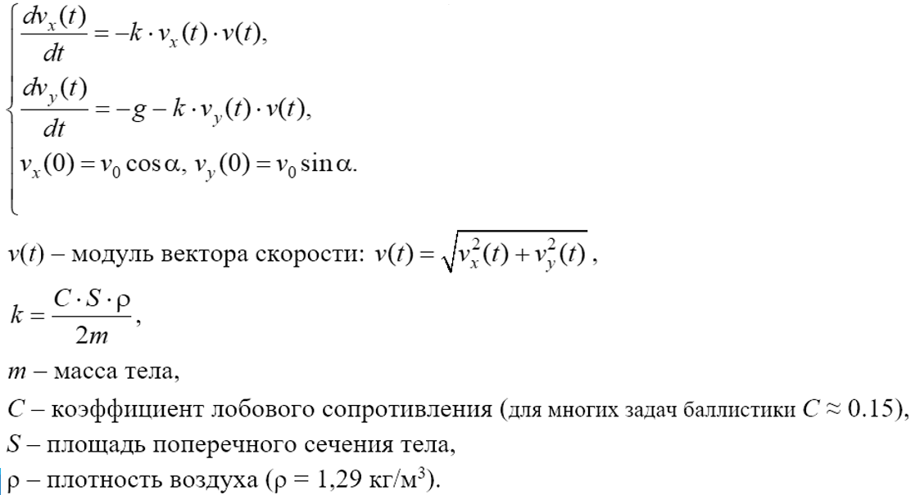
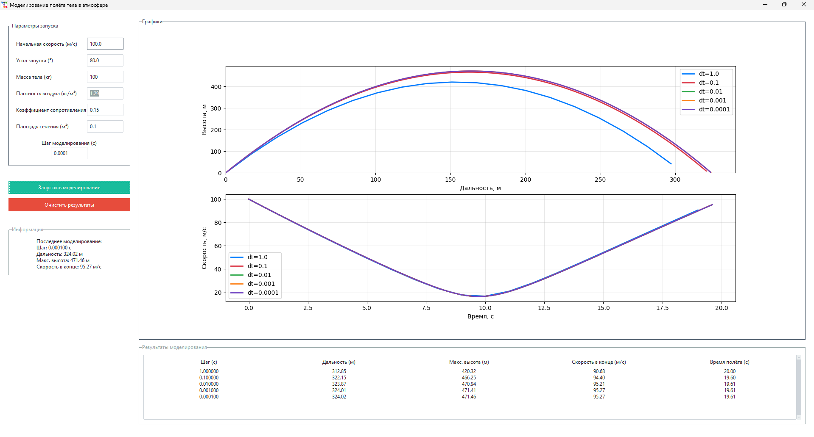

# 📘 ОТЧЁТ ПО ЛАБОРАТОРНОЙ РАБОТЕ

---

## Моделирование полёта тела в атмосфере

---

### 1. Цель работы

Реализовать приложение для моделирования полёта тела в атмосфере.
Исследовать влияние шага моделирования на точность численного решения и сравнить результаты.

---

### 2. Математическая модель

Движение тела описывается системой дифференциальных уравнений:

---

### 3. Результаты моделирования

- Начальная скорость: **100 м/с**
- Угол : **80°**
- Масса : **100 кг**
- Площадь сечения : **0.1 м²**

**Полученные данные:**

| Шаг моделирования, с | 1 | 0.1 | 0.01 | 0.001 | 0.0001 |
|----------------------|---|-----|------|-------|--------|
| Дальность полёта, м | 312.85 | 322.15 | 323.87 | 324.01 | 324.02 |
| Максимальная высота, м | 420.32 | 466.25 | 470.94 | 471.41 | 471.46 |
| Скорость в конечной точке, м/с | 90.68 | 94.40 | 95.21 | 95.27 | 95.27 |

---

---

### 4. Выводы

- При крупном шаге метод даёт заметную погрешность
- При уменьшении шага до **0.1 *(с)*** результаты становятся значительно ближе к реальным
- При шагах **0.01 (с)**, **0.001 (с)**, **0.0001 (с)** результаты практически совпадают

- Оптимальный шаг **0.01 (c)** для данной задачи, т.к. он обеспечивает высокую точность при минимальных затратах времени
