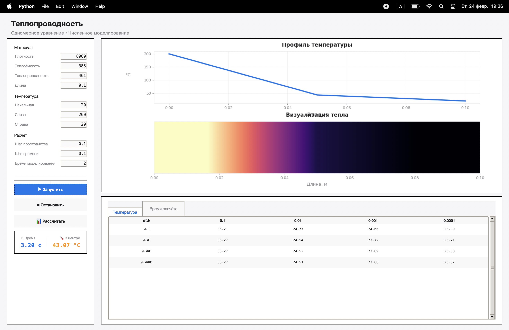

# Отчет по лабораторной работе №2
## Тема: Моделирование процесса теплопроводности методом конечных разностей

**Цель работы:** Реализовать численное решение одномерного уравнения теплопроводности с использованием неявной схемы и метода прогонки, проанализировать влияние шага по времени ($\tau$) и шага по пространству ($h$) на точность и скорость расчетов.

---

## 1. Параметры материала (Медь)
Для исследования была выбрана медная пластина со следующими физическими характеристиками:

* **Плотность ($\rho$):** 8960 кг/м³
* **Теплоемкость ($c$):** 385 Дж/(кг·К)
* **Теплопроводность ($\lambda$):** 401 Вт/(м·К)
* **Длина ($L$):** 0.1 м (10 см)

### Условия моделирования
* **Начальная температура ($T_0$):** 20°C (равномерно по всей толщине)
* **Граничные условия:** 200°C (слева) и 20°C (справа)
* **Время процесса ($t_{end}$):** 2.0 с

---

## 2. Результаты расчетов

#### Таблица 1. Температура в центральной точке пластины (°C)
| Шаг по времени $\tau$, с \ Шаг по пространству $h$, м | 0.1 | 0.01 | 0.001 | 0.0001 |
|-------------------------------------------------------|-------|-------|-------|--------|
| **0.1** | 35.21 | 24.77 | 24.00 | 23.99 |
| **0.01** | 35.27 | 24.54 | 23.72 | 23.71 |
| **0.001** | 35.27 | 24.52 | 23.69 | 23.68 |
| **0.0001** | 35.27 | 24.51 | 23.68 | 23.67 |

#### Таблица 2. Время расчёта моделирования (с)
| Шаг по времени $\tau$, с \ Шаг по пространству $h$, м | 0.1 | 0.01 | 0.001 | 0.0001 |
|-------------------------------------------------------|-------|-------|-------|--------|
| **0.1** | 0.0000 | 0.0000 | 0.0000 | 0.0003 |
| **0.01** | 0.0000 | 0.0000 | 0.0003 | 0.0024 |
| **0.001** | 0.0001 | 0.0002 | 0.0020 | 0.0171 |
| **0.0001** | 0.0004 | 0.0012 | 0.0142 | 0.0974 |

---

## 3. Вывод

* **Сходимость:** При уменьшении шагов $h$ и $\tau$ значение в центре пластины стабилизируется на отметке **23.67 – 23.68 °C**.

* **Погрешность и точность:** При самом грубом пространственном шаге ($h=0.1$ м), когда расчет ведется фактически по двум точкам, погрешность составляет более **11.5 °C** ($35.27$ против реальных $23.67$). Это подтверждает, что для получения достоверных физических данных по толщине 10 см необходимо использовать сетку с шагом не менее $h \le 0.001$ м.

* **Временная эффективность:** Проводить расчеты можно с  $\tau = 0.1$ без потери устойчивости, однако для высокой точности оптимальным является сочетание $\tau = 0.001$ с и $h = 0.001$ м, что обеспечивает баланс между скоростью (0.0020 с) и точностью результата.

---