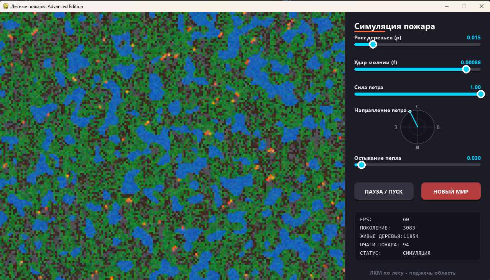

# Отчет по лабораторной работе
## Тема: Моделирование лесных пожаров с использованием двумерного клеточного автомата

### 1. Цель работы

Разработать программную модель симуляции возникновения и распространения лесных пожаров на базе двумерного клеточного автомата. Реализовать базовые правила поведения системы, добавить не менее трех дополнительных правил для повышения физической достоверности модели, а также разработать графический интерфейс пользователя (GUI) для управления параметрами в реальном времени.

### 2. Правила клеточного автомата
Модель представляет собой сетку, где каждая клетка может находиться в одном из 5 состояний: `EMPTY` (Пустая земля), `TREE` (Дерево), `FIRE` (Огонь), `WATER` (Вода), `ASH` (Пепел). Обновление состояний происходит покадрово (синхронно).

#### 2.1. Базовые правила
1. **Выгорание:** Горящая клетка переходит в стадию остывания (Пепел), а затем становится пустой землей.
2. **Распространение огня:** Дерево загорается, если горит хотя бы одна из соседних клеток (с учетом поправки на ветер).
3. **Самовозгорание ($f$):** Клетка с деревом загорается с вероятностью $f$ (удар молнии/человеческий фактор), независимо от наличия горящих соседей.
4. **Восстановление леса ($p$):** В пустой клетке (на плодородной земле) с вероятностью $p$ вырастает новое дерево.

#### 2.2. Дополнительные правила
Для усложнения поведения системы были введены следующие правила:
1. **Несгораемый ландшафт (Водоемы):** При инициализации мира процедурно генерируются озера с использованием алгоритма клеточного сглаживания белого шума. Вода не подвержена возгоранию и служит естественной преградой для распространения пожара.

2. **Векторный динамический ветер:** Направление ветра задается углом (радианы), который плавно изменяется во времени. Сила ветра регулируется пользователем. Ветер асимметрично искажает вероятности распространения огня: шанс перехода пламени по ветру стремится к 100%, а против ветра — падает до минимального базового значения.

3. **Стадия остывания (Пепелище):** Введена задержка восстановления ландшафта. Горящая клетка сначала становится Пеплом, на котором не могут расти деревья. Пепел переходит в состояние пустой земли с определенной вероятностью (смывается осадками). Это формирует реалистичный «шлейф» выгоревшего леса.

### 4. Особенности программной реализации
* **Векторизация вычислений:** Во избежание падения производительности из-за вложенных циклов `for`, обход клеток реализован через матричные операции библиотеки `NumPy`. Для получения состояний соседей используется топологический сдвиг матриц (`np.roll`), а правила применяются через наложение булевых масок (True/False). Это обеспечивает стабильные 60 FPS при размере сетки в десятки тысяч клеток.
* **Интерактивный интерфейс:** Разработана боковая панель управления (Dashboard) с пользовательскими ползунками (Sliders), позволяющими "на лету" изменять параметры $p$, $f$, силу ветра и скорость остывания пепла. 
* **Визуализация:** Интегрирован метеорологический радар для отображения текущего вектора ветра. Для рендера огня применяется эффект свечения (Bloom) через аддитивное смешивание и билинейную интерполяцию. Поддерживается ручной поджог клеток с помощью мыши.

### 5. Вывод
В ходе выполнения лабораторной работы была успешно создана высокопроизводительная модель клеточного автомата. Реализация дополнительных правил (ветер, озера, пепелище) позволила наблюдать: образование «огненных клиньев» под действием ветра, остановку фронта пламени у водоемов и цикличные паттерны восстановления леса.