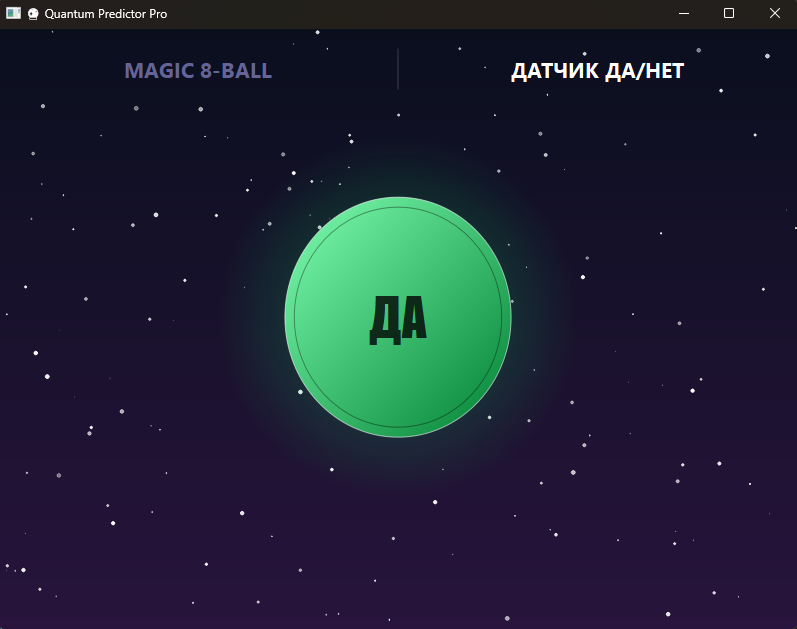
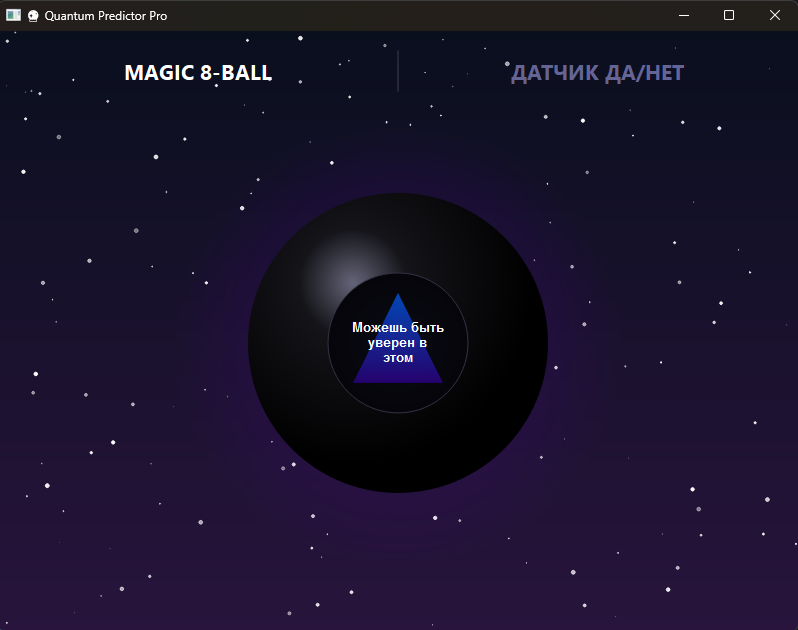

# Отчет по лабораторной работе №5 - Стохастическое моделирование случайных событий

Алгоритмы моделирования одиночных случайных событий и полных групп событий с использованием базового датчика случайных чисел

## Приложение «Скажи “да” или “нет”»

Для моделирования используется базовый датчик случайных чисел $\alpha$, распределенных равномерно на интервале $[0,1]$.

Пусть $A$ — событие (ответ **«ДА»**), а $p$ — вероятность его наступления.  
В рамках данной работы вероятность принята равной:

$$
p = 0.5
$$

Событие $A$ считается наступившим, если выполняется условие:

$$
\alpha < p
$$

---

## Приложение «Шар предсказаний» (Magic 8-Ball)

В данном случае рассматривается **полная группа попарно несовместных событий**:

$$
A_1, A_2, \dots, A_m
$$

(варианты ответов шара).

Сумма их вероятностей равна единице:

$$
\sum_{i=1}^{m} p_i = 1
$$

Для выбора одного из событий единичный отрезок $[0,1]$ разбивается на $m$ непересекающихся интервалов.  
Длина каждого интервала соответствует вероятности $p_i$.

---