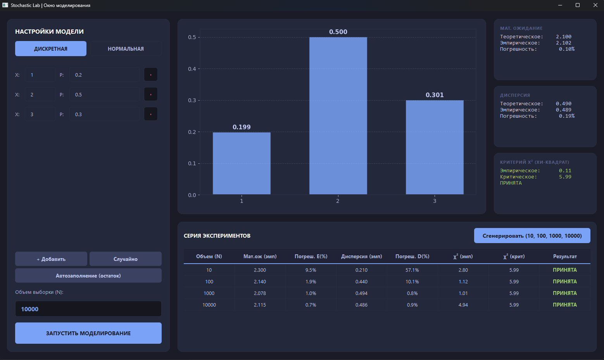
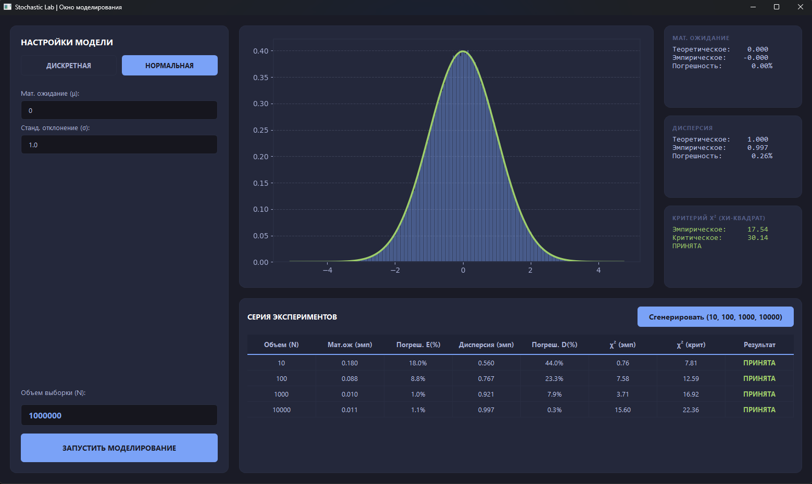

# Отчёт по лабораторной работе: Имитационное моделирование СВ

**Цель работы:** Программная реализация генераторов дискретных и непрерывных случайных величин, а также статистическая проверка адекватности моделей с использованием критерия согласия Пирсона ($\chi^2$).

---

## Часть 1. Дискретная случайная величина (ДСВ)

### 1.1. Алгоритм реализации
В файле `core.py` для генерации ДСВ реализован **метод «рулетки»** (интервальный метод). 
Суть метода:
1. Генерируется случайное число $\alpha \sim U(0, 1)$.
2. Из $\alpha$ последовательно вычитаются вероятности $p_i$ из ряда распределения.
3. Как только $\alpha \le 0$, выбирается соответствующее значение $x_i$.

### 1.2. Статистический анализ
Оценка близости эмпирических данных к теоретическим проводилась по формуле хи-квадрат, реализованной в методе `run_experiment_discrete`:
$$\chi^2_{emp} = \sum_{i=1}^{m} \frac{n_i^2}{N \cdot p_i} - N$$
где $n_i$ — частота попадания, $p_i$ — теоретическая вероятность.

**Результаты моделирования (ДСВ):**

| Объем (N) | Мат. ожидание (эмп) | Погрешность E (%) | Дисперсия (эмп) | Погрешность D (%) | $\chi^2$ (эмп) | $\chi^2$ (крит) | Результат |
| :--- | :--- | :--- | :--- | :--- | :--- | :--- | :--- |
| **10** | 2.300 | 9.5% | 0.210 | 57.1% | 2.80 | 5.99 | **ПРИНЯТА** |
| **100** | 2.140 | 1.9% | 0.440 | 10.1% | 1.12 | 5.99 | **ПРИНЯТА** |
| **1000** | 2.078 | 1.0% | 0.494 | 0.8% | 1.01 | 5.99 | **ПРИНЯТА** |
| **10000** | 2.115 | 0.7% | 0.486 | 0.9% | 4.94 | 5.99 | **ПРИНЯТА** |

---

## Часть 2. Нормальная случайная величина (НСВ)

### 2.1. Алгоритм реализации
Для моделирования НСВ в методе `generate_normal` использовано **преобразование Бокса-Мюллера**, которое позволяет получить стандартную нормальную величину из двух равномерно распределенных:
$$z_0 = \sqrt{-2 \ln(u_1)} \cdot \cos(2\pi u_2)$$
Затем значение масштабируется под заданные параметры: $x = \mu + z_0 \cdot \sigma$.

### 2.2. Группировка и проверка
Так как величина непрерывная, для применения критерия $\chi^2$ выборка разбивалась на интервалы. \
Количество интервалов $k$ определялось по формуле Стерджеса (в коде: $k = 1 + \log_2 N$). \
Теоретическая вероятность попадания в интервал $[a, b]$ вычислялась через функцию распределения (CDF):
$$P_i = \Phi\left(\frac{b - \mu}{\sigma}\right) - \Phi\left(\frac{a - \mu}{\sigma}\right)$$

**Результаты моделирования (НСВ):**

| Объем (N) | Мат. ожидание (эмп) | Погрешность E (%) | Дисперсия (эмп) | Погрешность D (%) | $\chi^2$ (эмп) | $\chi^2$ (крит) | Результат |
| :--- | :--- | :--- | :--- | :--- | :--- | :--- | :--- |
| **10** | 0.180 | 18.0% | 0.560 | 44.0% | 0.76 | 7.81 | **ПРИНЯТА** |
| **100** | 0.088 | 8.8% | 0.767 | 23.3% | 7.58 | 12.59 | **ПРИНЯТА** |
| **1000** | 0.010 | 1.0% | 0.921 | 7.9% | 3.71 | 16.92 | **ПРИНЯТА** |
| **10000** | 0.011 | 1.1% | 0.997 | 0.3% | 15.60 | 22.36 | **ПРИНЯТА** |

---

## Выводы

1. **Закон больших чисел в действии:** С ростом объема выборки $N$ относительная погрешность оценки математического ожидания и дисперсии закономерно снижается. Для НСВ при $N=10000$ погрешность дисперсии составила всего **0.3%**.
2. **Адекватность моделей:** Во всех экспериментах эмпирическое значение $\chi^2$ не превысило критическое. Это означает, что на уровне значимости $\alpha = 0.05$ гипотеза о соответствии полученных данных заданным распределениям не отвергается.