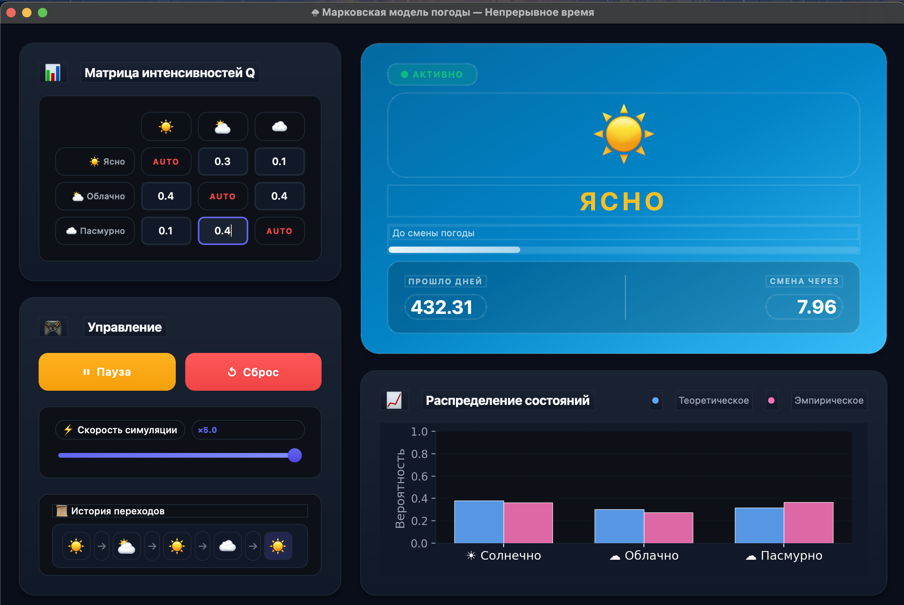

# Лабораторная работа: Марковская модель погоды

В данной лабораторной работе реализовано имитационное моделирование смены погодных условий (Ясно, Облачно, Пасмурно) с использованием **цепей Маркова с непрерывным временем** (СМС).

---

### **1. Постановка задачи**
Целью работы является моделирование динамической системы «Погода» с тремя дискретными состояниями:
*   **1 — Ясно**
*   **2 — Облачно**
*   **3 — Пасмурно**

Единица времени — **1 день**. \
Переходы между состояниями происходят не в фиксированные моменты, а через случайные промежутки времени, что соответствует теории непрерывного времени.

---

### **2. Математическая модель**
Для описания процесса используется **инфинитезимальная матрица интенсивностей $Q$**. \
Она обладает свойствами:
1.  $q_{ij} \ge 0$ при $i \neq j$ (интенсивность перехода из $i$ в $j$).
2.  $q_{ii} = -\sum_{j \neq i} q_{ij}$ (диагональный элемент равен сумме остальных элементов строки с обратным знаком).

---

### **3. Алгоритм имитационного моделирования**
Реализовано ядро модели на основе:

1.  **Генерация времени пребывания ($\tau$)**: 
    Используется метод обратной функции. Время нахождения в состоянии $i$ имеет экспоненциальное распределение. Формула реализации:
    $$\tau = \frac{\ln(\alpha)}{q_{ii}}$$
    где $\alpha \in (0,1)$ — случайное число от базового датчика (БД).
2.  **Выбор следующего состояния**: 
    После истечения времени $\tau$ происходит скачок в новое состояние $j$. Вероятность перехода вычисляется как:
    $$p_{ij} = \frac{q_{ij}}{-q_{ii}}$$
3.  **Статистическая обработка**:
    Для оценки вероятностей состояний накапливается суммарное время пребывания в каждом состоянии $Dur[i]$. Эмпирическая частота (вероятность) вычисляется как:
    $$Freq[i] = \frac{Dur[i]}{T_{total}}$$

---

### **4. Теоретическое обоснование**
Для проверки адекватности модели вычисляется **теоретическое стационарное распределение ($\pi$)**. Это вектор вероятностей, который удовлетворяет системе уравнений:
$$\begin{cases} \pi Q = 0 \\ \sum \pi_i = 1 \end{cases}$$
Решение данной системы позволяет узнать, к каким значениям должна стремиться накопленная статистика при длительном моделировании ($T \to \infty$).

---

### **5. Программная реализация**
Основные компоненты кода:
*   `update_matrix()`: Формирует генератор цепи и проверяет условие нулевой суммы строк.
*   `generate_next_transition()`: Выполняет преобразование случайного числа в физическое время и следующее состояние.
*   `get_empirical_distribution()`: Возвращает текущие статистические показатели для визуализации.

---

### **6. Результаты и выводы**
В ходе работы была реализована визуализация процесса смены погоды в «реальном» времени. Графики частот состояний наглядно демонстрируют сходимость эмпирических данных к расчетным теоретическим значениям $\pi$.

**Вывод:** Реализованная модель полностью соответствует теории марковских процессов с непрерывным временем. Имитационное моделирование позволяет с высокой точностью оценивать характеристики сложных систем, для которых затруднительно прямое аналитическое решение.