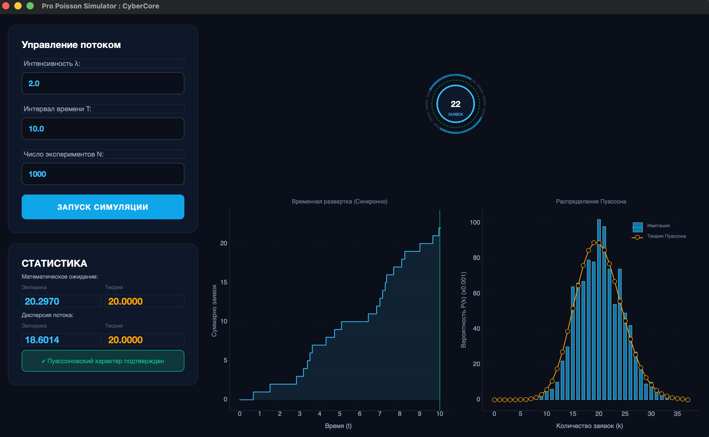

# Лабораторная работа №8: Моделирование потока заявок на сервер

**Тема:** Стохастическое моделирование. Дискретно-событийное моделирование простейшего (пуассоновского) потока.

## Демонстрация работы приложения



## Математическая модель и реализация

Приложение реализует симуляцию стационарного пуассоновского потока событий. Основные математические принципы, заложенные в коде:

1. **Генерация интервалов времени (Экспоненциальное распределение)**
   В простейшем потоке время между соседними событиями имеет экспоненциальное распределение. Интервал моделируется методом обратных функций: \

   $t_{next} = t_{prev} - \frac{\ln(\alpha)}{\lambda}$

   Функция `simulate_poisson_stream`, строка генерации:
   ```python
   t += -np.log(np.random.rand()) / lmbda
   ```

2. **Теоретическое распределение Пуассона**
   Вероятность поступления ровно $k$ заявок за интервал времени $T$ вычисляется по формуле:
   $$P(k) = \frac{(\lambda T)^k}{k!} e^{-\lambda T}$$
   Функция `get_theoretical_probs`, расчет вероятностей:
   ```python
   probs[k] = (math.pow(mu, k) * math.exp(-mu)) / math.factorial(k)
   ```

3. **Статистические характеристики**
   Главное свойство распределения Пуассона: математическое ожидание равно дисперсии и равно параметру формы $\mu = \lambda T$:
   $$\mathbb{E}[X] = \text{Var}(X) = \lambda T$$
   Функция `calculate_empirical_stats` считает фактические `np.mean` и `np.var` для сравнения с теорией.

## Выводы по результатам симуляции

В ходе эксперимента были заданы следующие параметры:
* Интенсивность потока ($\lambda$): **2.0**
* Интервал времени ($T$): **10.0**
* Число экспериментов ($N$): **1000**

**Анализ результатов:**
1. **Совпадение распределений:** На графике "Распределение Пуассона" видно, что гистограмма эмпирических частот (синие столбцы) практически идеально ложится на кривую теоретических вероятностей (оранжевая линия).
2. **Анализ числовых характеристик:** 
   * Теоретическое матожидание и дисперсия составляют $\lambda \times T = 20.0$.
   * Эмпирическое среднее (**20.2970**) и дисперсия (**18.6014**) лежат в допустимых пределах статистической погрешности для $N=1000$.
3. **Общий вывод:** Эмпирические данные подтверждают ключевое свойство пуассоновского потока — близость значений матожидания и дисперсии ($\mathbb{E}[X] \approx \text{Var}(X)$). Имитационная модель работает корректно и адекватно отражает процесс поступления случайных заявок на сервер.